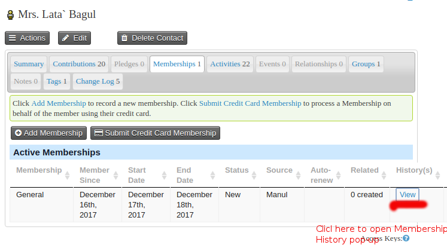
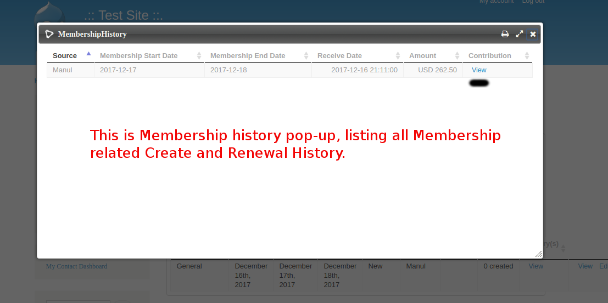
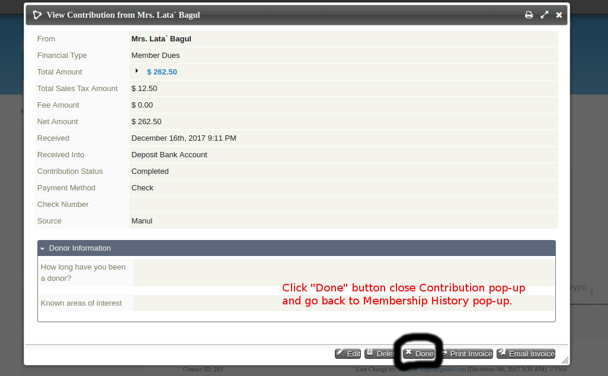

# com.example.membershiphistory

## What is Memebership history?

This is an Civicrm extension to display membership renewal history.

Currently, when a membership is renewed in CiviCRM the “end date” field on the membership itself is extended by the length of the membership as defined in CiviCRM membership type configuration but no record of the actual length of any one period or term is recorded. As such it is not possible to see how many “terms” or “periods” of membership a contact may have had. 

I.e. If a membership commenced on 1 Jan 2014 and each term was of 12 months in length, by 1 Jan 2016 the member would be renewing for their 3rd term. The terms would be:

Term/Period 1: 1 Jan 2014 - 31 Dec 2015
Term/Period 2: 1 Jan 2015 - 31 Dec 2016
Term/Period 3: 1 Jan 2016 - 31 Dec 2017

The aim of this extension is to extend the CiviCRM membership component so that when a membership is created or renewed a record for the membership “period” is recorded. 

The membership period is also connected to a contribution record if a payment is taken for this membership or renewal.

## How to install Membership history extension?
This is  free and open source extension for CiviCRM .

Steps to install:

1. Install Civicrm, related help find below: 
   https://docs.civicrm.org/sysadmin/en/latest/index.html

2. Download Membership Hisotry extension from below location:
   https://github.com/abhijeet15/civicrm-membershiphistory-ext

3. Add membership history files under `ext` folder. To locate `ext` folder path go to
   http://example.com/index.php?q=civicrm/admin/setting/path&reset=1 ( or in civicrm goto Administer >> system setting >>
   Directories ), here check for "Extensions Directory" path.

4. Then go to http://example.com/index.php?q=civicrm/admin/extensions&reset=1 ( or Administer >> system setting >> Extensions ), locate com.example.membershiphistory extension
   if not found click "Refresh" button at bottom of page.
   Once located click install.

## Usage:
- Once install, this extension will start recording membership history under mysql table "civirenewmebership_term", everythime
  contact membership is created or renewed.

- To view Membership history, go to Contact View Page > Membership listing. This extension add new coloum on membership listing as
  "History" with link to view history. So,
  - On membership listing, click on "View" link under history oloum, will open pop-up which will list all the creatted and renewal history related to 
    that particular members.
  - Membership period is also connected to contribution history, for that, on membership history listing pop-up, their is "View" link under 'Contribution' coloum, clicking
    on link will open contribution details in same pop-up. "View" link will only appear if Membership has contribution.
    Note: Click on "Done" button on Contribution details pop-up, will take back to Membership history page.
  - Deleting membership will also delete membership history records from mysql table "civirenewmebership_term" for that particular membership.

## Support

For any issue related to Civicrn Membership History extension feel free to email at Abhijeet Bagul<abhijeet.bagul@gmail.com>

